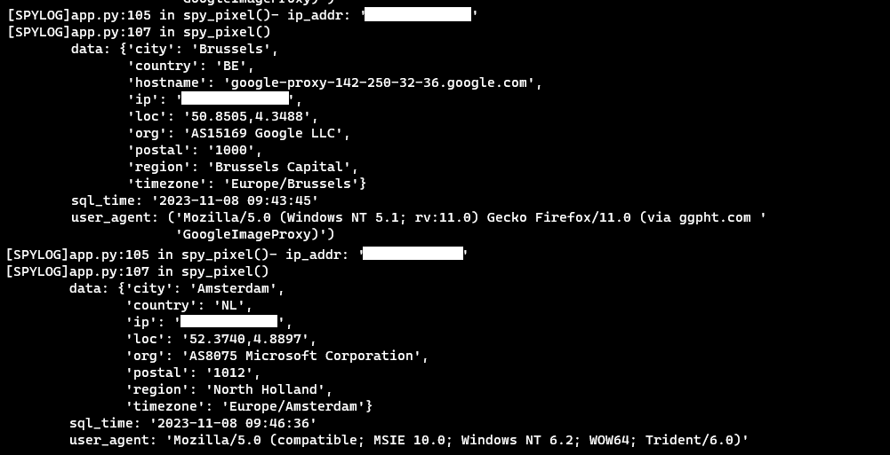

# Spy-Pixel


## Overview

> ⚠️ School project for the Security course ⚠️

The goal of this project is to create a Spy Pixel that can be sent through email to track users who open the email. The Spy Pixel is a small, invisible image. When a user opens the email, the image is loaded from the server, and the server logs the user's IP address. This Spy Pixel can be used to monitor user interactions and determine if the email has been opened.

## Installation

```bash
sudo apt-get install -y libmariadb-dev # For mariadb support
git clone https://github.com/YuToutCourt/Spy-Pixel.git
cd Spy-Pixel
pip install -r requirements.txt
```

### Run the sql code to create the database

```sql
-- MySQL Script generated by MySQL Workbench
-- Tue Oct 31 11:35:40 2023
-- Model: New Model    Version: 1.0
-- MySQL Workbench Forward Engineering

SET @OLD_UNIQUE_CHECKS=@@UNIQUE_CHECKS, UNIQUE_CHECKS=0;
SET @OLD_FOREIGN_KEY_CHECKS=@@FOREIGN_KEY_CHECKS, FOREIGN_KEY_CHECKS=0;
SET @OLD_SQL_MODE=@@SQL_MODE, SQL_MODE='ONLY_FULL_GROUP_BY,STRICT_TRANS_TABLES,NO_ZERO_IN_DATE,NO_ZERO_DATE,ERROR_FOR_DIVISION_BY_ZERO,NO_ENGINE_SUBSTITUTION';

-- -----------------------------------------------------
-- Schema mydb
-- -----------------------------------------------------

-- -----------------------------------------------------
-- Schema mydb
-- -----------------------------------------------------
CREATE SCHEMA IF NOT EXISTS `mydb` DEFAULT CHARACTER SET utf8 ;
USE `mydb` ;

-- -----------------------------------------------------
-- Table `mydb`.`Informations`
-- -----------------------------------------------------
CREATE TABLE IF NOT EXISTS `mydb`.`Informations` (
  `IP` VARCHAR(45) NOT NULL,
  `City` VARCHAR(256) NULL,
  `Region` VARCHAR(256) NULL,
  `ZIP` DOUBLE NULL,
  `Longitude` VARCHAR(256),
  `Latitude` VARCHAR(256),
  `Organization` VARCHAR(256) NULL,
  `TimeZone` VARCHAR(256) NULL,
  `TimeStamp` VARCHAR(256) NULL,
  `User_Agent` VARCHAR(200) NULL,
  `Country` VARCHAR(200) NULL,
  PRIMARY KEY (`IP`))
ENGINE = InnoDB;


SET SQL_MODE=@OLD_SQL_MODE;
SET FOREIGN_KEY_CHECKS=@OLD_FOREIGN_KEY_CHECKS;
SET UNIQUE_CHECKS=@OLD_UNIQUE_CHECKS;
```

### Launch the server

```bash
python3 /app/app.py
```

## Usage

### Send the Spy Pixel
You can use free browser extensions like:

•  [HTML Editor for Gmail](https://chrome.google.com/webstore/detail/free-html-editor-for-gmai/ioinaaeeacahcmbgfmeaaofhfkijpdeb) 

Include the following code in your email:

```html

THE REST OF YOUR EMAIL
```

When the user opens the email, the image is loaded from the server, and the server logs the user's IP address.

Please note that in many email clients, the email is opened by the email provider's proxy. In such cases, the logged IP address will be that of the proxy, not the user. You can let the user click on the link to a website that contains the Spy Pixel. This way, the user's IP address will be logged when the user visits the website.



*Provider proxy of Gmail, outlook that get logs instead of the user's IP address*

### **Proton Mail may detect and block the Spy Pixel.**


*Proton Mail detects the Spy Pixel*

## ⚠️ Warning ⚠️

**This project is for educational purposes only. Do not use it for illegal activities.**


## Legal Concerns Regarding Spy Pixels:

Spy pixels can collect personal data without explicit user consent, potentially violating privacy rights and data protection laws. It is essential for spy pixels to comply with national and regional data protection laws, such as GDPR in Europe. Businesses must be transparent about their use of spy pixels and inform users adequately to avoid legal sanctions.


## What GDPR Says About Spy Pixels: 

The use of a spy pixel is prohibited. Companies must ensure GDPR compliance when using tracking technologies to avoid penalties and fines. It's worth noting that the Privacy and Electronic Communications Regulations (PECR) of 2003 already restrict the use of tracking pixels. Website owners must also explicitly mention the use of tracking pixels in their privacy policy.

This is my README for SpyPixel. I have translated, corrected errors, and improved the content. It is provided in markdown format.


